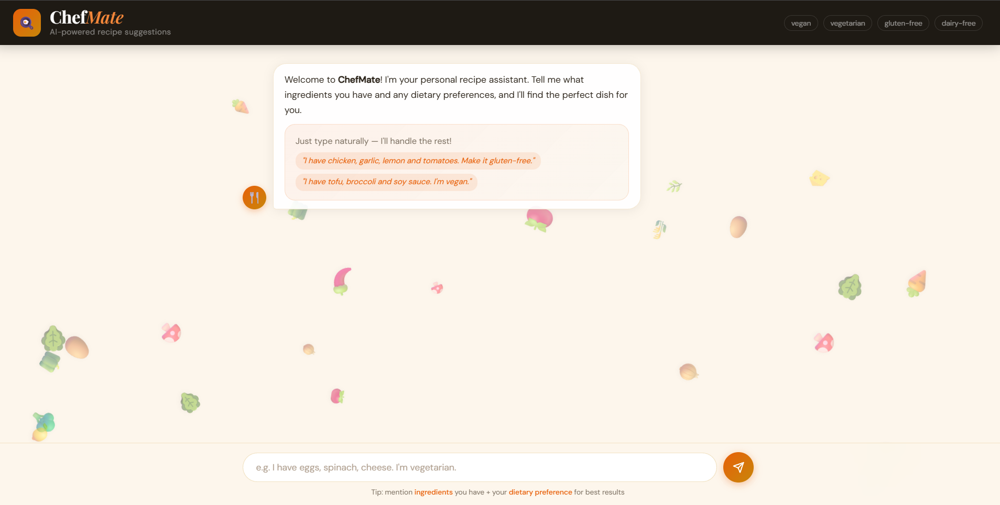
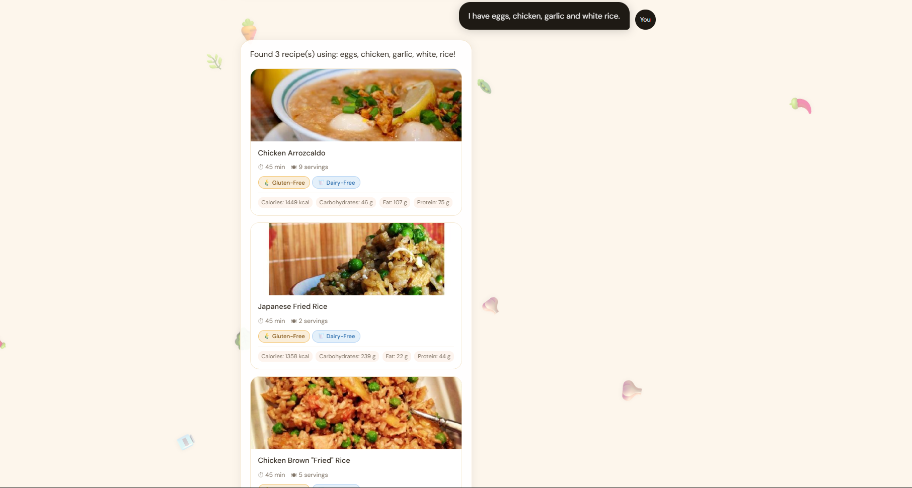

# 🍳 ChefMate — AI-Powered Recipe Suggestion Chatbot

> A conversational recipe assistant that suggests dishes based on ingredients you have and your dietary preferences, powered by the Spoonacular API.

## 🌐 Live Demo

🔗 [https://chefmate-chatbot.onrender.com](https://chefmate-chatbot.onrender.com)

---

## 💡 Features

- 🥕 **Ingredient-based search** — Tell ChefMate what you have, it finds matching recipes
- 🥗 **Dietary filters** — Supports vegan, vegetarian, gluten-free, and dairy-free preferences
- 🍽️ **Recipe cards** — Displays image, cook time, servings, and nutrition info
- 🔴 **Real-time data** — Powered by the Spoonacular Food API (live recipe database)
- 💬 **Conversational UI** — Natural language input, no structured commands needed
- ✨ **Animated interface** — Food-themed floating background, smooth message animations

---

## 🛠️ Tech Stack

| Layer               | Technology                                             |
| ------------------- | ------------------------------------------------------ |
| **Frontend**        | HTML5, CSS3, JavaScript (Vanilla)                      |
| **Backend**         | Python 3, Flask                                        |
| **API**             | Spoonacular Food API                                   |
| **NLP**             | Rule-based intent parsing (regex + keyword extraction) |
| **Deployment**      | Render (Web Service)                                   |
| **Version Control** | Git + GitHub                                           |

---

## 📁 Project Structure

```
chefmate-chatbot/
│
├── app.py               # Flask server — routes and API handling
├── chatbot.py           # Core NLP logic — ingredient parser + Spoonacular calls
├── requirements.txt     # Python dependencies
├── Procfile             # Render deployment config
├── .env                 # API key (local only, not uploaded)
├── .env.example         # Safe API key template for reference
├── .gitignore           # Excludes .env and venv from git
│
├── templates/
│   └── index.html       # Frontend UI — chat interface with animated background
│
└── static/
    └── script.js        # Chat logic — message handling, API calls, recipe rendering
```

---

## ⚙️ How It Works

```
User Input (natural language)
        ↓
  parse_user_message()
  → extracts ingredients using regex
  → detects dietary preference (vegan / vegetarian / gluten-free / dairy-free)
        ↓
  search_recipes_by_ingredients()
  → calls Spoonacular findByIngredients API
        ↓
  get_recipe_details()
  → fetches full recipe info (nutrition, diet flags, cook time)
  → applies dietary filter
        ↓
  Flask returns JSON → Frontend renders recipe cards
```

---

## 🚀 Local Setup

### Prerequisites

- Python 3.x
- VS Code
- Spoonacular API key — free at [spoonacular.com/food-api](https://spoonacular.com/food-api)

### Installation

```bash
# 1. Clone the repository
git clone https://github.com/YOUR_USERNAME/chefmate-chatbot.git
cd chefmate-chatbot

# 2. Create and activate virtual environment
python -m venv venv
venv\Scripts\activate        # Windows
source venv/bin/activate     # Mac/Linux

# 3. Install dependencies
pip install -r requirements.txt

# 4. Set up environment variable
cp .env.example .env
# Open .env and paste your Spoonacular API key

# 5. Run the app
python app.py
```

Then open **http://localhost:5000** in your browser.

---

## 🧪 Sample Inputs to Test

| Input                                         | Expected Output          |
| --------------------------------------------- | ------------------------ |
| `I have chicken, garlic and tomatoes`         | Chicken-based recipes    |
| `I have tofu, broccoli, soy sauce. I'm vegan` | Vegan tofu recipes       |
| `eggs, cheese, spinach. vegetarian`           | Vegetarian egg dishes    |
| `rice, lemon, ginger. gluten-free`            | Gluten-free rice recipes |

---

## 📦 Dependencies

```
flask
requests
python-dotenv
gunicorn
```

---

## 🔑 Environment Variables

| Variable              | Description                       |
| --------------------- | --------------------------------- |
| `SPOONACULAR_API_KEY` | Your API key from spoonacular.com |

Create a `.env` file in the root folder:

```
SPOONACULAR_API_KEY=your_api_key_here
```

---

## 📸 Screenshots

### 🏠 Welcome Screen



### 🍽️ Recipe Results



---

## 📄 License

This project is for learning purposes. Feel free to use it!

---

## 🙏 Acknowledgements

- [Spoonacular API](https://spoonacular.com/food-api) — Recipe and nutrition data
- [Flask](https://flask.palletsprojects.com/) — Python web framework
- [Google Fonts](https://fonts.google.com/) — Playfair Display & DM Sans
- [Render](https://render.com/) — Free cloud deployment

---

## 👨‍💻 Author

**Your Name**

- GitHub: https://github.com/sumanth-nallajonnala
- Email: sumanth.nljna@gmail.com

---

Made with ❤️ by Sumanth Nallajonnala...
